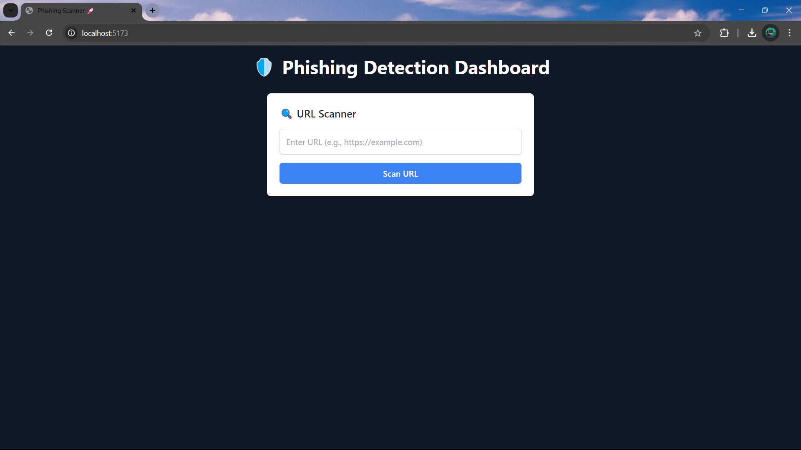
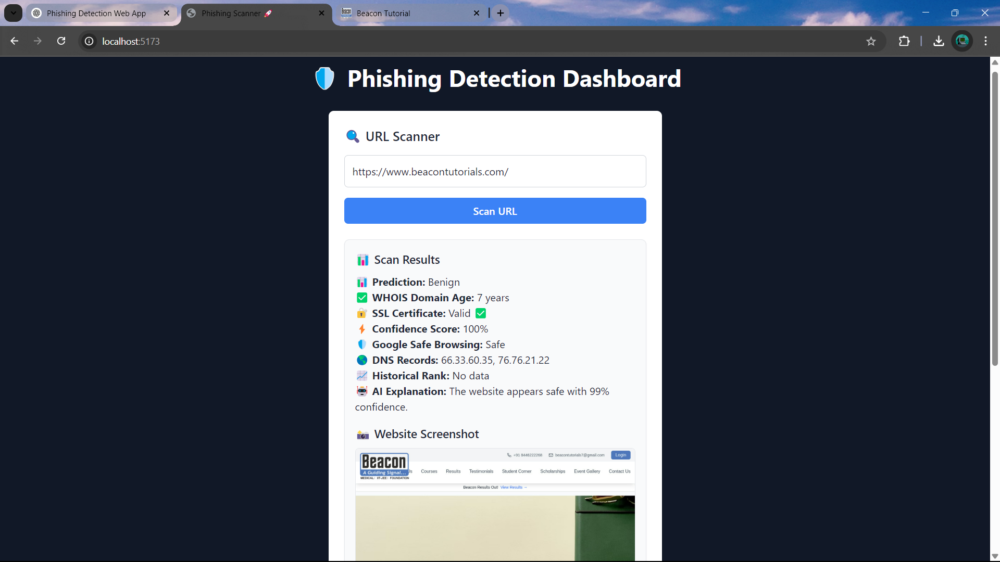
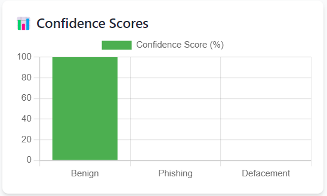

# 🚀 Phishing Website Detection Web App

<div align="center">
  
  <br />
  <p><strong>A machine learning-powered web application to detect phishing websites</strong></p>
</div>

## 🔍 Overview

This web application detects phishing websites using machine learning models (RandomForest & LightGBM). It analyzes URLs and provides comprehensive security insights.

### Key Features

- ✅ Phishing Prediction (Benign / Phishing)
- ✅ Confidence Score
- ✅ SSL Certificate Validation
- ✅ WHOIS Domain Age Check
- ✅ DNS Record Check
- ✅ Google Safe Browsing API Check
- ✅ Historical Website Rank
- ✅ Full WHOIS Data Dump
- ✅ AI Explanation of Predictions
- ✅ Website Screenshot

## 📸 Screenshots

<div align="center">
 
  <p><em>Home Page</em></p>
  
  
  <p><em>URL Scan Results</em></p>
  
  
  <p><em>Graph Visualization</em></p>
</div>

## 🛠️ Tech Stack

### Frontend
- React + Vite + TailwindCSS
- Charts.js for Data Visualization
- Axios for API Calls

### Backend
- FastAPI (Python)
- Joblib for ML Model Loading
- WHOIS & SSL Certificate Checks
- Google Safe Browsing API

## ⚡ Features

### ✅ Machine Learning-Based Prediction
Uses RandomForest & LightGBM models to analyze a URL's features and determine if it's a phishing website.

### ✅ Confidence Score
Shows how certain the model is in its prediction.

### ✅ SSL Certificate Validation
Checks if the website has a valid SSL certificate for secure browsing.

### ✅ WHOIS Domain Age Check
Verifies how old the domain is (Newer domains are riskier).

### ✅ DNS Record Check
Ensures the website has valid DNS records (MX, A, NS, etc.).

### ✅ Google Safe Browsing API
Cross-checks the URL against Google's database of unsafe websites.

### ✅ Full WHOIS Data Dump
Displays registrar information, expiration date, and owner details.

### ✅ Historical Website Rank
Fetches ranking from Alexa / SimilarWeb to check legitimacy.

### ✅ AI Explanation for Phishing Flagging
Provides a human-readable reason why a URL was flagged as phishing.

### ✅ Website Screenshot
Captures a live screenshot of the entered URL.

## 🚀 Setup Guide

### 1️⃣ Clone the Repository
```bash
git clone https://github.com/your-username/phishing-detection.git
cd phishing-detection
```

### 2️⃣ Backend Setup (FastAPI)
```bash
cd backend
pip install -r requirements.txt
uvicorn main:app --reload
```
✅ FastAPI will run at http://127.0.0.1:8000

### 3️⃣ Frontend Setup (React + Vite)
```bash
cd frontend
npm install
npm run dev
```
✅ React will run at http://localhost:5173

## 🌟 API Endpoints

| Method | Endpoint | Description |
|--------|----------|-------------|
| POST | `/predict` | Predicts if a URL is phishing or benign |
| GET | `/healthcheck` | Checks if the backend is running |
| GET | `/whois/{url}` | Fetches WHOIS information |
| GET | `/screenshot/{url}` | Captures website screenshot |

## 📜 License

This project is open-source under the MIT License.

## 📢 Contributing

Feel free to fork the repo, submit issues, and contribute improvements! 🚀

## 🔥 Author

👨‍💻 **Rajvardhan Deshmukh**  
📧 rajvardhanhd6403@gmail.com  
🔗 [LinkedIn](https://www.linkedin.com/in/rajvardhan-deshmukh-323787229/)
